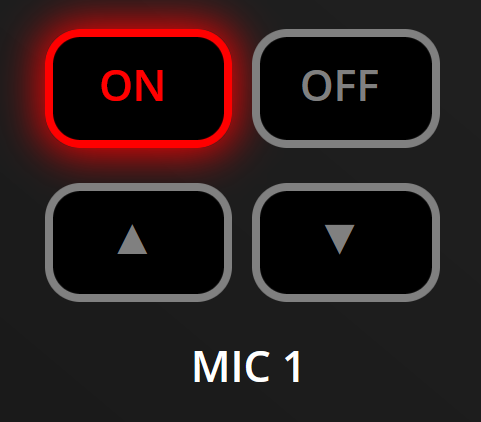

# ATEM Mini Extreme Button Pusher

I needed a way to show various configurations for an ATEM Mini Extreme
for documentation purposes, whilst the ATEM was installed in another location,
and I was having difficulty getting really good high quality, easy to read
photos of what different configurations of the ATEM look like.

So I spent 4 hours on a Sunday afternoon and made this:

[https://farseeker.github.io/ATEM-ButtonPusher/](https://farseeker.github.io/ATEM-ButtonPusher/)

There's no validation on the buttons you can configure. You can create a totally
invalid configuration if you want to. But what this does allow me to do is set up
the panel the way I need to for a specific portion of my training documents, and zoom
and crop the image in a high resolution for showing specifics (just zoom your browser in, it
should scale properly).

Only supports the ATEM Mini Extreme at the moment, could easily support other ATEM Mini
models if someone wanted to make them.

## Examples

Example showing the entire board layout

Example showing a zoomed in portion of the ATEM

Example showing another zoomed in portion, this time with
different states for the buttons

